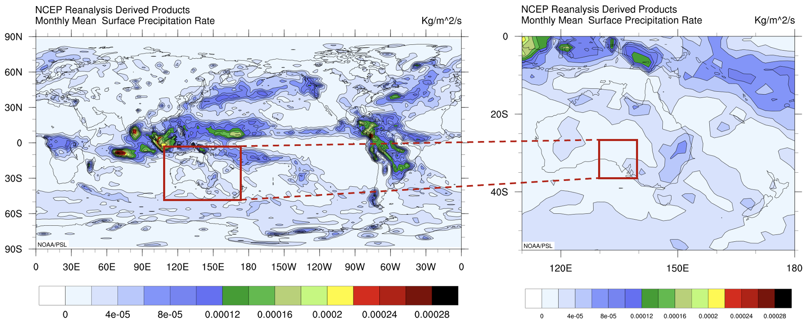
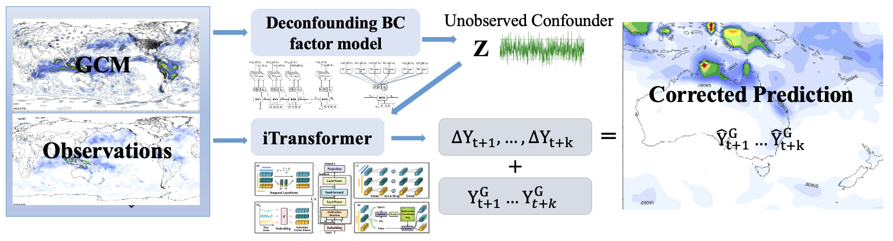
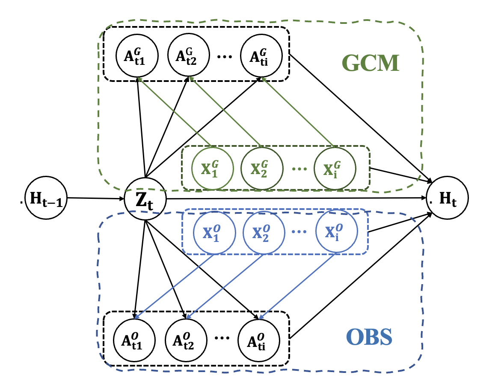

# Deconfounding Multi-Cause Latent Confounders: A Factor-Model Approach to Climate Model Bias Correction

This repository contains the code for our IJCAI submission paper: "Deconfounding Multi-Cause Latent Confounders: A Factor-Model Approach to
Climate Model Bias Correction."

This paper have been accepted by IJCAI2025.

Our study area is South Australia.



As described in the paper, our method is divided into two parts: 'Deconfounding' and 'Correction'.



## Data Preparation

### Simulation Data

To generate simulation data for Deconfounding, follow these steps:

1. Run the following command to generate the simulated datasets:

    ```python
    python main_run_simulation.py
    ```

   This will produce the simulated datasets from two sources and combine them into a CSV file. After the training process, a `.pkl` file will be generated.

2. To process the results and convert them into a CSV file, run:

    ```python
    python result_process.py 
    ```

### Real-World Data

For real-world data, download the necessary datasets from the following sources:

- **IPSL Data Portal:** [IPSL CMIP6 Data](https://aims2.llnl.gov/search/cmip6)
- **NCEP-NCAR Reanalysis 1 Data Portal:** [NCEP-NCAR Reanalysis](https://psl.noaa.gov/data/gridded/data.ncep.reanalysis.html)

For both datasets, select all variables at the surface level and at 2 meters, and download the monthly data. The data will be in `.nc` (NetCDF) format. Convert these `.nc` files to CSV format, and extract the relevant data for South Australia.

**Note:** For IPSL data, you'll need to download all experimental settings, ranging from `r1p1i1f1` to `r33p1i1f1`.

After obtaining the South Australia CSV file, remove any columns with a significant amount of missing data.

## Deconfounding

The first part, Deconfounding, is crucial as it introduces insights from deconfounding in causal inference to climate bias correction. Unlike traditional methods, it does not assume that all variables are observed. We demonstrate our approach using a simulation dataset, which is created based on the summary causal graph shown below:


To better understand the Deconfounding BC factor model. Let's have a look at the graph.



And our Deconfounding BC factor model structure can be show as figure below:


## Correction

The second part, Correction, involves using the latent confounder learned in the Deconfounding step as an additional feature for precipitation correction. As described in the paper, we chose the state-of-the-art model, iTransformer, to perform this step. The implementation can be found in Correction folder. 

After you processed the data already. You can put the data into dataset/weather folder. And simply run 

```
bash ./scripts/multivariate_forecasting/Weather/bc_iTransformer.sh
```


Notice this part is based on the [iTransformer GitHub Repository](https://github.com/thuml/iTransformer).

## Parameters and Configurations

### Deconfounding

| Parameter              | Value   | Description                              |
|------------------------|---------|------------------------------------------|
| Hidden Units           | 128     | Number of hidden units in RNN layers     |
| Learning Rate          | 0.001   | Learning rate for optimizer              |
| Batch Size             | 16      | Number of samples per batch              |
| Training Epochs        | 50      | Number of training epochs                |
| RNN Dropout Probability| 0.8     | Probability to prevent overfitting       |
| Gamma Parameter ($\gamma$)| 0.6 | Strength of autoregressive process       |

### Correction (iTransformer)

| Parameter       | Value   | Description                                      |
|-----------------|---------|--------------------------------------------------|
| History Length  | 36      | Length of input sequence                        |
| Prediction Length| 3      | Length of output sequence                       |
| Input Dimensions| 55      | Number of input features                        |
| Batch Size      | 8       | Number of samples per batch                     |
| Learning Rate   | 0.0001  | Learning rate for optimizer                     |
| Random Seed     | 2024    | Seed for random number generator to ensure reproducibility |


For more details on these parameters, refer to the configuration files and scripts in the repository.


