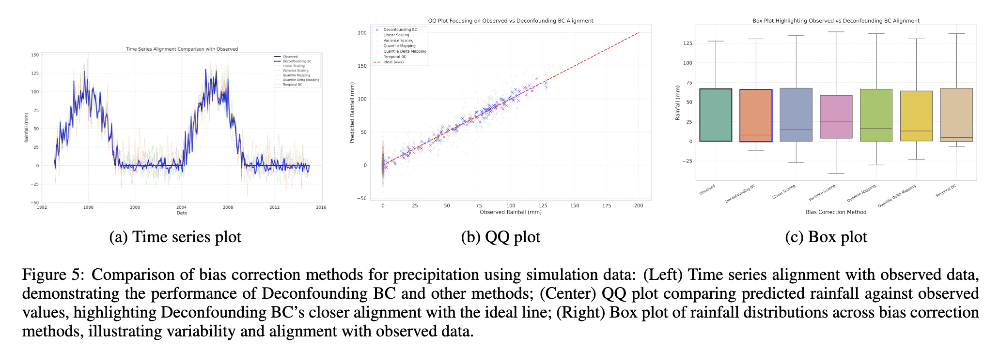
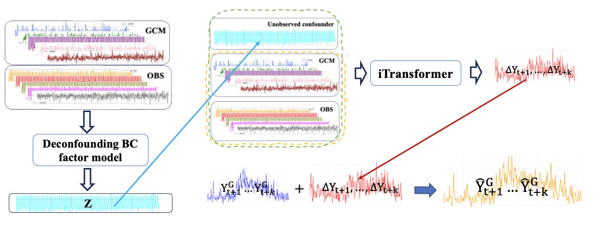

# A-deconfounding-approach-to-climate-model-bias-correction

This code is for AAAI submission paper: A-deconfounding-approach-to-climate-model-bias-correction

Our study area is South Australia.

As descriped in the paper, our method is devided into two part, 'Deconfounding' and 'Correction'

## Deconfounding

First part is most import part as it is the first time to bring some insight from deconfounding in causal inference to climate bias correction
which do not need to assume "All variable are observed". We gonna show our code with the simulation dataset. The simulation dataset is created 
based on the summary causal graph as Figure(c) below shows.

As for case study real world dataset, can be download from the link below:

- IPSL data portal: https://aims2.llnl.gov/search/cmip6

- NCEP-NCAR reanalysis 1 data portal: https://psl.noaa.gov/data/gridded/data.ncep.reanalysis.html

  

## Correcrtion

Second part is correction which is trying to used the latent confounder learnt by deconfounding part as an additional feature for precipitation 
correction. As descriped in the paper, we choose the SOTA model iTransformer to perform this step. Implementation is given in https://github.com/thuml/iTransformer.

